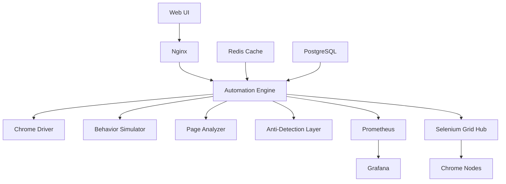

# 🤖 Advanced Web Automation Framework

<div align="center">


**A FAANG-level web automation framework with sophisticated anti-detection mechanisms, human-like behavior simulation, and comprehensive monitoring capabilities.**

[Features](#-features) • [Quick Start](#-quick-start) • [Documentation](#-documentation) • [Demo](#-demo) • [Contributing](#-contributing)


</div>

---

## 📋 Table of Contents

- [Overview](#-overview)
- [Features](#-features)
- [Architecture](#-architecture)
- [Quick Start](#-quick-start)
- [Installation](#-installation)
- [Usage](#-usage)
- [Configuration](#-configuration)
- [API Reference](#-api-reference)
- [Testing](#-testing)
- [Deployment](#-deployment)
- [Monitoring](#-monitoring)
- [Security](#-security)
- [Contributing](#-contributing)
- [License](#-license)

## 🎯 Overview

The **Advanced Web Automation Framework** is an enterprise-grade solution for web automation that implements cutting-edge techniques for browser automation while maintaining ethical standards and legal compliance. Built with Python and Selenium, it features sophisticated anti-detection mechanisms, realistic human behavior simulation, and comprehensive monitoring capabilities.

### 🎓 Educational Purpose

This framework is designed for:
- **QA Engineers** learning advanced testing techniques
- **Security Researchers** understanding bot detection methods
- **Developers** building automation tools
- **Students** studying web technologies

> ⚠️ **Important**: This tool is for educational and authorized testing purposes only. Always respect websites' Terms of Service and robots.txt files.

## ✨ Features

### 🎭 Advanced Behavior Simulation
- **Bézier Curve Mouse Movements**: Natural, human-like cursor trajectories
- **Intelligent Typing Patterns**: Variable speed with realistic mistakes and corrections
- **Smart Scrolling**: Context-aware page navigation
- **Behavioral Personas**: 5 distinct user behavior patterns (Casual, Focused, Explorer, Scanner, Researcher)

### 🛡️ Anti-Detection Capabilities
- **Browser Fingerprint Randomization**: Dynamic profile generation
- **WebGL & Canvas Protection**: Advanced fingerprinting countermeasures
- **Stealth Mode**: Undetectable automation flags
- **Proxy Rotation Support**: IP diversity for large-scale operations

### 🔍 Intelligent Page Analysis
- **ML-like Heuristics**: Smart element detection and interaction
- **Framework Detection**: React, Angular, Vue.js compatibility
- **Dynamic Content Handling**: AJAX and SPA support
- **Semantic Analysis**: Understanding page structure and purpose

### 📊 Monitoring & Analytics
- **Real-time Performance Metrics**: CPU, memory, and response time tracking
- **Session Recording**: Detailed logs and screenshots
- **Prometheus Integration**: Metrics collection and alerting
- **Grafana Dashboards**: Beautiful visualization of automation metrics

### 🐳 Modern Infrastructure
- **Docker Support**: Containerized deployment
- **Kubernetes Ready**: Scalable orchestration with HPA
- **Selenium Grid Integration**: Distributed testing capabilities
- **CI/CD Compatible**: GitHub Actions, Jenkins, GitLab CI support

## 📸 Platform Interface

<div align="center">
  <table>
    <tr>
      <td align="center" width="50%">
        <h3>🎨 Modern Dashboard</h3>
        <p>Clean, intuitive interface showcasing advanced automation capabilities with real-time demonstrations</p>
      </td>
      <td align="center" width="50%">
        <h3>🚀 Live Demo</h3>
        <p>Interactive demonstrations of mouse movement, typing simulation, and intelligent scrolling patterns</p>
      </td>
    </tr>
  </table>
</div>

## 🏗️ Architecture



### Component Overview

| Component | Description | Technology |
|-----------|-------------|------------|
| **Automation Engine** | Core automation logic | Python 3.11, Selenium |
| **Behavior Simulator** | Human-like interaction patterns | NumPy, Custom algorithms |
| **Anti-Detection Layer** | Stealth mechanisms | JavaScript injection |
| **Page Analyzer** | Intelligent element detection | Pattern matching, Heuristics |
| **Web UI** | Interactive demonstration interface | HTML5, JavaScript, CSS3 |
| **Data Storage** | Session and metrics storage | PostgreSQL, Redis |
| **Monitoring** | Performance tracking | Prometheus, Grafana |

## 🚀 Quick Start

### Prerequisites

- Docker 24.0+ and Docker Compose 2.0+
- Python 3.11+ (for local development)
- 4GB RAM minimum
- Chrome/Chromium browser

### 30-Second Setup

```bash
# Clone the repository
git clone https://github.com/yourusername/web-automation-framework.git
cd web-automation-framework

# Create required directories for the screenshot
mkdir -p docs/images

# Save the interface screenshot to docs/images/automation-demo-interface.png

# Start with Docker Compose
docker-compose up -d

# View the web interface
open http://localhost:8080

# Check automation logs
docker-compose logs -f automation
```

That's it! 🎉 The framework is now running.

## 💻 Installation

### Method 1: Docker (Recommended)

```bash
# Build the Docker image
docker build -t web-automation:latest .

# Run with Docker Compose
docker-compose up -d

# Verify services are running
docker-compose ps
```

### Method 2: Local Installation

```bash
# Create virtual environment
python -m venv venv
source venv/bin/activate  # On Windows: venv\Scripts\activate

# Install dependencies
pip install -r requirements.txt

# Install Chrome driver
python -m webdriver_manager.chrome

# Run the application
python src/main.py
```

### Method 3: Kubernetes Deployment

```bash
# Create namespace
kubectl create namespace web-automation

# Apply manifests
kubectl apply -f kubernetes/

# Check deployment status
kubectl get all -n web-automation

# Port forward for access
kubectl port-forward -n web-automation svc/web-automation-service 8000:8000
```

## 📖 Usage

### Basic Example

```python
from src.main import AdvancedWebAutomation, BehaviorPattern, UserBehavior

# Initialize with specific behavior pattern
behavior = UserBehavior.generate_persona(BehaviorPattern.FOCUSED)
automation = AdvancedWebAutomation(behavior=behavior, headless=False)

# Navigate to a website
automation.navigate_with_intelligence("https://example.com")

# Perform intelligent interactions
automation.interact_intelligently(max_interactions=5)

# Export session data
session_data = automation.export_session_data()
print(f"Session completed: {session_data['session_id']}")

# Cleanup
automation.cleanup()
```

### Advanced Configuration

```python
from src.main import BrowserProfile, AdvancedWebAutomation

# Custom browser profile
profile = BrowserProfile(
    user_agent="Mozilla/5.0 (Custom) AppleWebKit/537.36",
    viewport=(1920, 1080),
    timezone="America/New_York",
    language="en-US",
    platform="Win32",
    vendor="Google Inc.",
    plugins=["Chrome PDF Plugin"],
    webgl_vendor="Intel Inc.",
    webgl_renderer="Intel Iris",
    hardware_concurrency=8,
    device_memory=16
)

# Initialize with custom profile
automation = AdvancedWebAutomation(
    profile=profile,
    headless=True,
    use_proxy=True,
    enable_monitoring=True
)
```

### Behavior Patterns

| Pattern | Description | Use Case |
|---------|-------------|----------|
| **CASUAL** | Slow, relaxed browsing | Mimicking regular users |
| **FOCUSED** | Direct, goal-oriented | Form submissions, checkouts |
| **EXPLORER** | Curious, clicks many elements | Content discovery testing |
| **SCANNER** | Quick page scanning | Information extraction |
| **RESEARCHER** | Thorough, reads everything | Documentation testing |

## ⚙️ Configuration

### Environment Variables

Create a `.env` file in the project root:

```env
# Application Settings
LOG_LEVEL=INFO
HEADLESS_MODE=false
ENABLE_MONITORING=true
MAX_WORKERS=5

# Browser Configuration
BROWSER_TIMEOUT=30
PAGE_LOAD_STRATEGY=eager
WINDOW_SIZE=1920x1080

# Database
POSTGRES_HOST=postgres
POSTGRES_PORT=5432
POSTGRES_DB=automation_db
POSTGRES_USER=automation_user
POSTGRES_PASSWORD=secure_password

# Redis
REDIS_HOST=redis
REDIS_PORT=6379
REDIS_PASSWORD=redis_password

# Selenium Grid
SELENIUM_HUB_HOST=selenium-hub
SELENIUM_HUB_PORT=4444

# Monitoring
PROMETHEUS_PORT=9090
GRAFANA_PORT=3000
GRAFANA_PASSWORD=admin
```

### Configuration Files

- `config/automation.yaml` - Main automation settings
- `config/behaviors.json` - Behavior pattern definitions
- `config/proxies.txt` - Proxy rotation list
- `monitoring/prometheus.yml` - Prometheus configuration
- `monitoring/grafana/dashboards/` - Grafana dashboard definitions

## 📚 API Reference

### Core Classes

#### `AdvancedWebAutomation`

Main automation class that orchestrates all operations.

```python
class AdvancedWebAutomation:
    def __init__(self,
                 profile: Optional[BrowserProfile] = None,
                 behavior: Optional[UserBehavior] = None,
                 headless: bool = False,
                 use_proxy: bool = False,
                 enable_monitoring: bool = True)
    
    def navigate_with_intelligence(self, url: str) -> None
    def interact_intelligently(self, max_interactions: int = 5) -> None
    def export_session_data(self) -> Dict[str, Any]
    def cleanup(self) -> None
```

#### `BrowserProfile`

Browser fingerprint configuration.

```python
@dataclass
class BrowserProfile:
    user_agent: str
    viewport: Tuple[int, int]
    timezone: str
    language: str
    platform: str
    vendor: str
    plugins: List[str]
    webgl_vendor: str
    webgl_renderer: str
    hardware_concurrency: int
    device_memory: int
    
    @classmethod
    def generate_random_profile(cls) -> 'BrowserProfile'
```

#### `UserBehavior`

User behavior simulation settings.

```python
@dataclass
class UserBehavior:
    pattern: BehaviorPattern
    reading_speed: float  # words per minute
    typing_speed: float   # characters per second
    mouse_precision: float  # 0-1
    attention_span: float  # seconds
    curiosity_level: float  # 0-1
    
    @classmethod
    def generate_persona(cls, pattern: BehaviorPattern) -> 'UserBehavior'
```

## 🧪 Testing

### Running Tests

```bash
# Run all tests
pytest tests/ -v

# Run with coverage
pytest tests/ --cov=src --cov-report=html

# Run specific test file
pytest tests/test_automation.py -v

# Run integration tests only
pytest tests/ -m integration
```

### Test Structure

```
tests/
├── unit/
│   ├── test_browser_profile.py
│   ├── test_mouse_movement.py
│   └── test_behavior_patterns.py
├── integration/
│   ├── test_page_analysis.py
│   └── test_anti_detection.py
└── e2e/
    └── test_full_automation.py
```

## 🚢 Deployment

### Production Deployment

#### Docker Swarm

```bash
# Initialize swarm
docker swarm init

# Deploy stack
docker stack deploy -c docker-compose.yml automation-stack

# Scale services
docker service scale automation-stack_automation=5
```

#### Kubernetes Production

```bash
# Apply production configs
kubectl apply -f kubernetes/ --namespace=production

# Enable autoscaling
kubectl autoscale deployment web-automation \
  --min=2 --max=10 --cpu-percent=70 \
  -n production

# Setup ingress
kubectl apply -f kubernetes/ingress.yaml
```

#### Cloud Deployments

<details>
<summary>AWS ECS</summary>

```bash
# Build and push to ECR
aws ecr get-login-password --region us-east-1 | docker login --username AWS --password-stdin $ECR_REPO
docker build -t web-automation .
docker tag web-automation:latest $ECR_REPO/web-automation:latest
docker push $ECR_REPO/web-automation:latest

# Deploy with ECS CLI
ecs-cli compose up --cluster automation-cluster
```

</details>

<details>
<summary>Google Cloud Run</summary>

```bash
# Build and deploy
gcloud builds submit --tag gcr.io/PROJECT_ID/web-automation
gcloud run deploy web-automation \
  --image gcr.io/PROJECT_ID/web-automation \
  --platform managed \
  --region us-central1
```

</details>

<details>
<summary>Azure Container Instances</summary>

```bash
# Create container instance
az container create \
  --resource-group automation-rg \
  --name web-automation \
  --image automation.azurecr.io/web-automation:latest \
  --cpu 2 --memory 4
```

</details>

## 📊 Monitoring

### Metrics Dashboard

Access Grafana at `http://localhost:3000` (default credentials: admin/admin)

#### Available Dashboards:
- **Automation Overview**: Success rates, performance metrics
- **Browser Performance**: Page load times, resource usage
- **Behavior Analytics**: Interaction patterns, session duration
- **System Metrics**: CPU, memory, network usage

### Prometheus Queries

```promql
# Success rate
rate(automation_success_total[5m]) / rate(automation_attempts_total[5m])

# Average session duration
avg(automation_session_duration_seconds)

# Page load performance
histogram_quantile(0.95, rate(page_load_duration_bucket[5m]))
```

### Logging

Logs are structured in JSON format for easy parsing:

```json
{
  "timestamp": "2024-01-15T10:30:45.123Z",
  "level": "INFO",
  "session_id": "sess_abc123",
  "behavior": "FOCUSED",
  "action": "click",
  "element": "button#submit",
  "duration_ms": 125,
  "success": true
}
```

## 🔒 Security

### Security Features

- ✅ **Non-root Docker containers**
- ✅ **Secrets management via environment variables**
- ✅ **Network isolation with Docker networks**
- ✅ **Rate limiting and request throttling**
- ✅ **Input validation and sanitization**
- ✅ **Secure communication (HTTPS support)**

### Best Practices

1. **Never commit sensitive data**
   ```bash
   # Add to .gitignore
   .env
   *.key
   *.pem
   ```

2. **Use secrets management**
   ```bash
   # Kubernetes secrets
   kubectl create secret generic automation-secrets \
     --from-literal=api-key=$API_KEY
   ```

3. **Regular security updates**
   ```bash
   # Update dependencies
   pip install --upgrade -r requirements.txt
   
   # Scan for vulnerabilities
   docker scan web-automation:latest
   ```

### Ethical Guidelines

⚠️ **Important Legal and Ethical Considerations:**

- **Always obtain permission** before automating interactions with any website
- **Respect robots.txt** and terms of service
- **Implement rate limiting** to avoid overwhelming servers
- **Use for legitimate purposes only** (testing, research, accessibility)
- **Never use for:** spam, fraud, unauthorized data collection, or malicious activities

## 🤝 Contributing

We welcome contributions! Please see our [Contributing Guide](CONTRIBUTING.md) for details.

### Development Setup

```bash
# Fork and clone the repository
git clone https://github.com/yourusername/web-automation-framework.git
cd web-automation-framework

# Create a branch
git checkout -b feature/your-feature-name

# Install development dependencies
pip install -r requirements-dev.txt

# Install pre-commit hooks
pre-commit install

# Make your changes and run tests
pytest tests/

# Commit with conventional commits
git commit -m "feat: add new behavior pattern"

# Push and create a pull request
git push origin feature/your-feature-name
```

### Code Style

- Follow PEP 8 guidelines
- Use type hints
- Add docstrings to all functions
- Write tests for new features
- Update documentation

## 📄 License

This project is licensed under the MIT License - see the [LICENSE](LICENSE) file for details.

```
MIT License

Copyright (c) 2024 Web Automation Framework

Permission is hereby granted, free of charge, to any person obtaining a copy
of this software and associated documentation files (the "Software"), to deal
in the Software without restriction, including without limitation the rights
to use, copy, modify, merge, publish, distribute, sublicense, and/or sell
copies of the Software, and to permit persons to whom the Software is
furnished to do so, subject to the following conditions:

The above copyright notice and this permission notice shall be included in all
copies or substantial portions of the Software.

THE SOFTWARE IS PROVIDED "AS IS", WITHOUT WARRANTY OF ANY KIND, EXPRESS OR
IMPLIED, INCLUDING BUT NOT LIMITED TO THE WARRANTIES OF MERCHANTABILITY,
FITNESS FOR A PARTICULAR PURPOSE AND NONINFRINGEMENT. IN NO EVENT SHALL THE
AUTHORS OR COPYRIGHT HOLDERS BE LIABLE FOR ANY CLAIM, DAMAGES OR OTHER
LIABILITY, WHETHER IN AN ACTION OF CONTRACT, TORT OR OTHERWISE, ARISING FROM,
OUT OF OR IN CONNECTION WITH THE SOFTWARE OR THE USE OR OTHER DEALINGS IN THE
SOFTWARE.
```

## 🙏 Acknowledgments

- [Selenium](https://www.selenium.dev/) - Web automation framework
- [Docker](https://www.docker.com/) - Containerization platform
- [Kubernetes](https://kubernetes.io/) - Container orchestration
- [Prometheus](https://prometheus.io/) - Monitoring and alerting
- [Grafana](https://grafana.com/) - Analytics and visualization

## 📞 Support

- 📧 Email: support@example.com
- 💬 Discord: [Join our server](https://discord.gg/example)
- 📖 Documentation: [docs.example.com](https://docs.example.com)
- 🐛 Issues: [GitHub Issues](https://github.com/yourusername/web-automation-framework/issues)

## 🌟 Star History

[](https://star-history.com/#yourusername/web-automation-framework&Date)

---

<div align="center">

**Built with ❤️ for the automation community**

[⬆ Back to Top](#-advanced-web-automation-framework)

</div>
